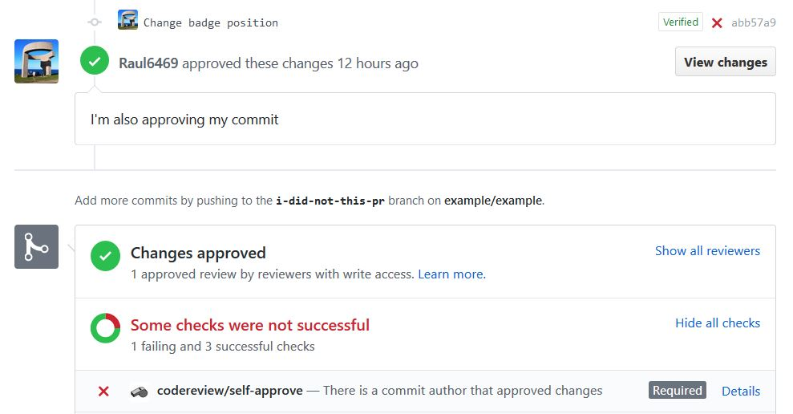

# self-approve

A GitHub App built with Probot that checks if someone approved a pull request AND authored commits in it. If so, the status is set to failure. This way, you can always be sure to have a fresh review before merging!

## Use
Works in addition to the "Require pull request reviews before merging" protected branch setting. This setting alone allows merging with one minimum positive review, submitted by any contributor as long as it's not the PR author, regardless of the commit authors. This app checks that there is no reviewer that contributed to this specific PR.

> The GitHub app is running on a limited server. This is meant for test purposes only, and the app can be shut down at any moment without notice. So feel free to experiment, but until I find a better server, this is not meant for a real use.

## Contributing :tada:
Any contribution is welcome, I will be more than happy to hear your suggestions (issues or PRs)!
